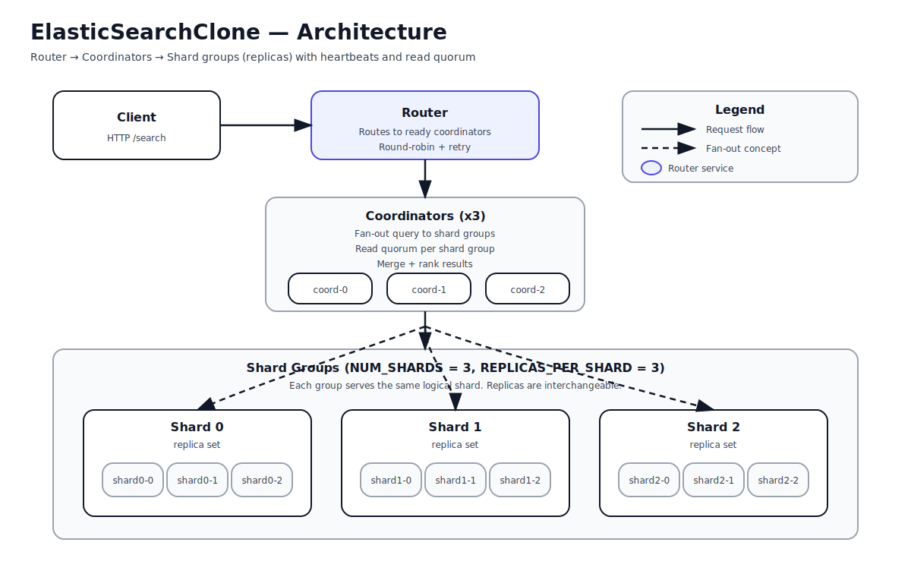
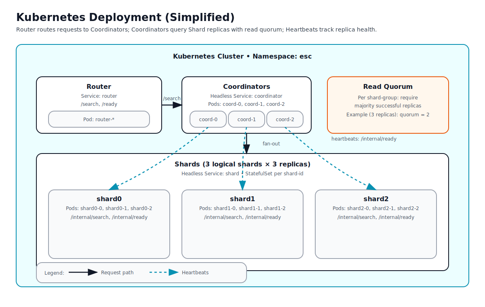

## Why This Project Exists

This project was built as part of a **Distributed Systems** course with two goals:

1. **Understand how real-world distributed systems work internally**
2. **Gain hands-on experience with the same tools used in production systems**
   (Docker, Kubernetes, health checks, replication, quorum logic)

Rather than implementing a simplified or theoretical solution, the goal was to
design and build a **realistic search system architecture inspired by Elasticsearch**,
including:

- Independent services
- Failure detection
- Replication
- Quorum-based reads
- Self-healing orchestration

The result is a system that behaves like a real production deployment while
remaining understandable and easy to reason about.

## Mapping to Distributed Systems Theory

This project intentionally implements core distributed systems principles:

| Concept                  | Implementation                                      |
|--------------------------|-----------------------------------------------------|
| Replication              | Each shard has multiple independent replicas        |
| Failure detection        | Heartbeat-based health checks                       |
| Quorum                   | Read quorum enforced per shard group                |
| Fault tolerance          | Requests succeed despite replica failure            |
| Self-healing             | Kubernetes automatically restarts failed pods       |
| Load balancing           | Router distributes traffic across coordinators      |
| Partial failure handling | System continues operating with degraded components |
| Stateless services       | Router and coordinators are stateless by design     |

These concepts are commonly discussed theoretically in distributed systems
courses; this project demonstrates how they behave in practice.

## Demo Walkthrough

A typical live demonstration follows this flow:

1. Deploy the system to Kubernetes
2. Verify all pods are healthy
3. Send a search request through the router
4. Kill a shard replica pod during operation
5. Observe:
   - Replica marked as `SUSPECT` / `DOWN`
   - Quorum logic continues serving requests
   - Kubernetes automatically recreates the pod
6. Observe replica rejoining the cluster

This demonstrates real-world fault tolerance and self-healing behavior.

## What I Learned

Through this project I learned:

- Why distributed systems are designed as multiple independent services
- How quorum logic prevents incorrect results under partial failure
- Why health checks must be separate from liveness
- How orchestration systems like Kubernetes simplify failure recovery
- How containerization enables reproducible, scalable deployments
- Why stateless services are easier to scale and recover

Most importantly, I learned how theory translates into real engineering tradeoffs.

## Production Considerations

This project is intentionally simplified for learning purposes.

In a real production system, the following would be added:

- Persistent storage for shard data
- Write quorums and consistency guarantees
- Snapshotting and recovery
- Autoscaling based on load
- Observability (metrics, tracing, logging)
- Security (authentication, authorization, TLS)

## Architecture Diagram

- **Router**  
  Entry point for clients. Routes requests to healthy coordinators.
- **Coordinators**  
  Fan out queries to shard replicas, enforce quorum, merge results.
- **Shards**  
  Store and search indexed data. Each shard has multiple replicas.

## Kubernetes Deployment Architecuture

